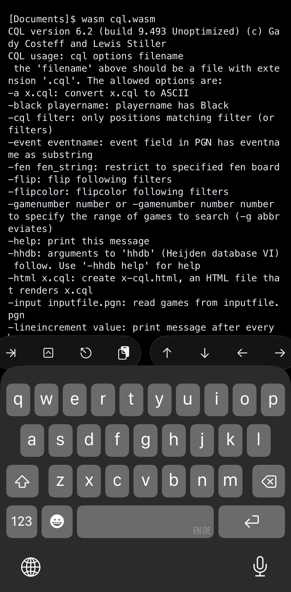

ABOUT THIS CODE
---------------

This is a fork of the [CQL](https://www.gadycosteff.com/cql) source distribution "build 9.493," as obtained from this URL: https://www.gadycosteff.com/cql/download.html

**This is a work in progress!**

HOW I HAVE CHANGED THIS CODE
----------------------------

This code includes the changes I've made to get CQL 6.2 to run on an iPhone inside [a-shell](https://holzschu.github.io/a-Shell_iOS/).

In order to get CQL to compile, I am using [the latest WASI
SDK](https://github.com/WebAssembly/wasi-sdk/releases), version 29.0 as of this
writing. I have had to remove multithreading/mutexes and all use of C++
exceptions, since neither are supported by WASI's libc++. So far, I've removed
this functionality by strategically commenting it out; see the git history in
this repo for the gory details. In many cases I've indicated my changes with a comment that says "Dan:". My approach has not been elegant or pretty, and
may break some of CQL's functionality; please consider this code **highly
experimental.** Proceed with caution!

Maybe if I have time later I'll come back and do it more cleanly. For now I just wanted to get it working so I can play with CQL on my phone.

BUILDING & RUNNING ON iOS
-------------------------

Here's how I do this on my Mac.

Download the [WASI SDK](https://github.com/WebAssembly/wasi-sdk/releases), edit `src/makefile-flags` so the `COMPILE` and `LINK` variables point at the `clang++` and `wasm-ld` contained therein, respectively, then run `make`.

**Optional**: If you have [wasmtime](https://wasmtime.dev) installed, you can test the resulting `cql.wasm` with all the CQL file examples in `exalpha/` by running `make test` (of the original `exalpha` examples, 4 do not currently work; I have moved them to `exalpha-excludes`, and will move them back if/when I can get them working).

Finally, copy `cql.wasm` to the a-shell directory on your iOS device. You should now be able to run it with:

```
wasm cql.wasm [arguments]
```

If you clone this git repo into your a-shell environment and copy or move `cql.wasm` into its top level, you can run the tests by overriding the default wasm executable to use the one that comes with a-shell, like this:

`make test WASM=wasm`

For more about building C++ projects for a-shell, check out [the book](https://bianshen00009.gitbook.io/a-guide-to-a-shell/lets-do-more-for-it/compile-a-simple-command-with-a-shell).

ABOUT LICENSING
---------------

I am a huge fan of Gady Costeff and Lewis Stiller, and of Shane Hudson and SCID, but I also believe in free/open source software and I would like to get this right.

The distribution from which this fork is derived came with the message reproduced in the `src/readme-original.txt` file, which mentions that the contents of the `src/orig/` directory are derived from GPLv2 SCID code by Shane Hudson. It does not explicitly apply any particular license to the code outside the `src/orig/` directory.

However, the website from which this code was obtained asserts in its FAQ that:

"CQL is built using the PGN parser written by Shane Hudson, licensed under GPL 2, which is part of the SCID/CQL integration chess database system. All code not in the subdirectory orig is licensed under an MIT license."
 -- https://www.gadycosteff.com/cql/faq.html

My understanding of the GPLv2 is that any code derived from a GPLv2 licensed
work must also be released under the GPLv2. As such, it seems we *must*
consider the CQL source distribution to also be released under GPLv2, and thus,
the current code with my changes must also be released under the GPLv2, a copy
of which is to be found in the LICENSE file. In sum:

This program is free software; you can redistribute it and/or
modify it under the terms of the GNU General Public License
as published by the Free Software Foundation; either version 2
of the License, or (at your option) any later version.

This program is distributed in the hope that it will be useful,
but WITHOUT ANY WARRANTY; without even the implied warranty of
MERCHANTABILITY or FITNESS FOR A PARTICULAR PURPOSE.  See the
GNU General Public License for more details.

You should have received a copy of the GNU General Public License
along with this program; if not, see
<https://www.gnu.org/licenses/>.

If you feel I've got this wrong, please don't hesitate to reach out by opening an issue on this Github repo.

In any case, it is without doubt that the copyright for the non-SCID files in
the distribution from which this fork derives is still retained by Lewis
Stiller and Gady Costeff.

--Dan Friedman, Toronto, December 2025.
